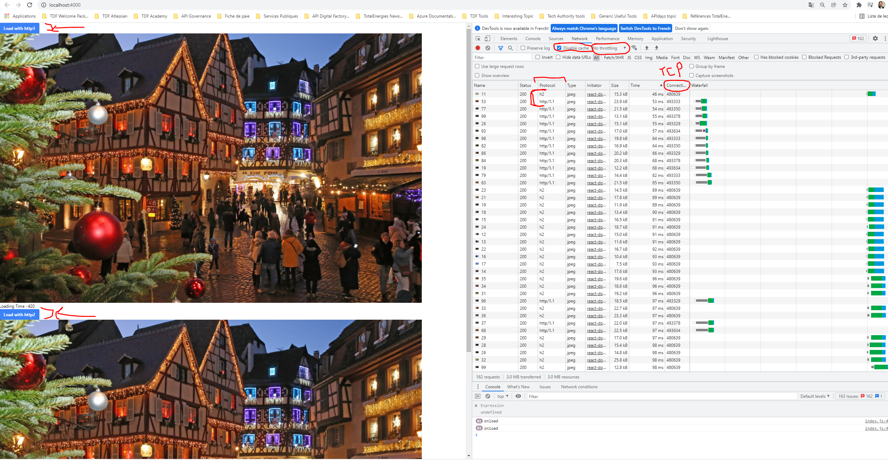

# http2-vs-http1-demo-service
Benchmarking HTTP2 against HTTP1.1 using Nodejs/Express

## Description
HTTP2 vs HTTP1.1 Server with NodeJS/Express.

This is a POC to compare and study the differences between http1 and http2.
For my experiment I launched 2 servers on my ordinary computer:
- Node.js on port 3001 serving over HTTP/1.1 
- Node.js on port 443 serving over HTTP/2

The two servers serve the same static images files from exactly the same path /Config/lib/img3 on my computer.

#### To Notice
- HTTP/2 requires encryption using TLS. Browsers do not support unencrypted HTTP/2.
- The contents of requests from browsers and responses from servers have a straightforward format. Each HTTP message includes a request, status, headers and a body.
  - In HTTP/1.1, the messages are transferred through network without any additional transformations.
  - In HTTP/2, the headers are compressed and all the messages are transferred not as text but as numbers.

## What is http2
- Http2 is a major evolution of http1.1 released in 2015 and mainly inspired by the SPDY protocol.
- In this POC I compare the throughput of HTTP/2 and HTTP/1.1. But first I briefly mention the major differences between the two protocols.
- **The differences**
  - In HTTP/1.1, the messages are transferred through network without any additional transformations.
  - In HTTP/2, the headers are compressed and all the messages are transferred not as text but as numbers.
  - HTTP/2 requires encryption using TLS. Browsers do not support unencrypted HTTP/2.
  - Multiplexing : HTTP/2 allows multiple requests and responses to be transferred on the same TCP connection at the same time.
  - With http1.1 Only one request per TCP connection can be pending at a time. To make multiple parallel requests from the same server, browsers open several TCP connections. (for more information about Browser Queueing [click-here](https://developer.chrome.com/docs/devtools/network/reference/#timing-explanation))

## POC Architecture
- The advantage of this architecture is the use of the same application source code for both http1 and http2 servers. I configured only two ports for each server and the whole code is the same for both servers.
- Ideally  use a http2 bridge module that allows you to keep the same source code of your server. In our case we used Http2 Express Bridge, which allows me to : 
  - Create a http2 server with express.js application.
  - Revert automatically to Http1.1 if the browser don't support http2.
- We have two Nodejs/express server (https/1.1 : 3001) and (https:2 : 443)
- The two servers serve the same static images files from exactly the same path /Config/lib/img3 on my computer
- Client side application (build) with reactJs

## Pros And Cons Of HTTP/2
- Pros 
  - One TCP connection 
  - Parallel requests (Multiplexing)
  - Server Push System Feature (have to enable)
  - Hpack (a compression format for efficiently representing HTTP2 header fields, for more information [click-here](https://httpwg.org/specs/rfc7541.html#rfc.status))
  - More security because the browser requires the use of tls 

- Cons
  - Proxies that dont support http2 might slow down your perf
  - Load balancer layer 7 (a layer 7 load balancer that doesnt support h2 will slow down when your web server supports it)
  - Abuse of **Server Push** system (NO risk in our case)
    - In our case the squad does not intend to use this functionality of http2
  

- **Performance tab**

| Protocol | Online | Fast 3G | Slow 3G |
| -------- | -------- | -------- | -------- |
| HTTP 1.1 | 605 ms  | 11.72 s    | 41.40 s    |
| HTTP/2   | 240 ms | 9.27 s   | 30 s    |

## Conclusion
- Is HTTP/2 faster than HTTP/1.1 ? Well, in our case with a Nodejs/Express server configuration We have shown a tangible difference between the two protocol versions. In contrast, I advise you to check other optimization mechanism in order to have the best results. 

## Advice
I share with you some optimization tips :
  - In order to guarantee high availability of your application, we can make the application scalable
    - For stateless application you can scale horizontally (Example: deploy in kubernetes node)
  - Use a load balancer to optimize the processing of traffic management 
  - Use a distributed cache system to lighten the traffic on the database (Redis)
  - Use distributed search engine (Ex : Elasticsearch, it centralizes the storage of your data and ensures ultra-fast search, high relevance and powerful and scalable analysis)
  - Use a micro-service architecture for optimal distribution based on traffic.

## RUN

#### Generate a self signe certificate with openSSL
`For demonstration purposes we used openssl to generate our auto-signed certificate (not recommended for a production environment)`
- Command : `openssl req -x509 -newkey rsa:4096 -nodes -sha256 -subj '//CN=localhost' -keyout localhost-private-key.pem -out localhost-cert.pem`
- **Note** : the certificate and the private key are available in the /Config/lib directory

#### Run project command
To start to whole project with http/1.1, http/2 and client side app you can run this command : `npm run start`

You can also start each part separately with commands bellow :
- Start server http1 : `npm run http1`
- Start server http2 : `npm run http2`
- Start client app   : `npm run client`

#### Test your server

GO to [http://localhost:4000/](http://localhost:4000/) and enjoy the experience :)

You can use curl command : ` you must run this command from the root of the project`
- test http1 server : `curl --cacert Config/lib/localhost-cert.pem https://localhost:443/api/test`
- test http2 server : `curl --cacert Config/lib/localhost-cert.pem https://localhost:3001/api/test`

## Insight
In the browser dev tools you can see both http1 and http2 protocol, tcp connection id and more ...
